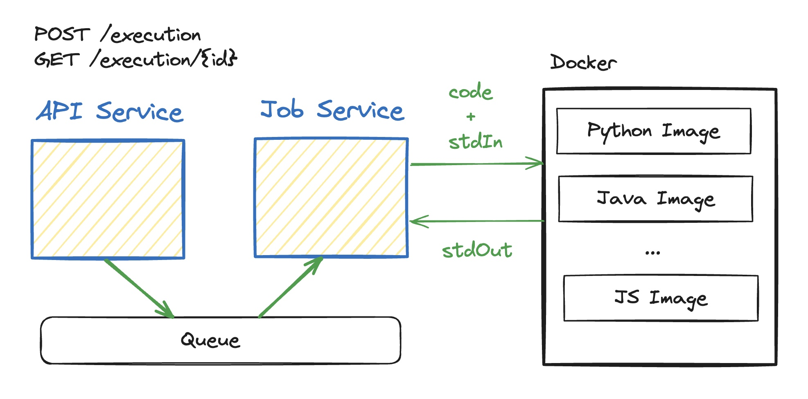

# CodeGeet 

Codegeet is an open-source solution for executing code in isolated, secure Docker containers. 
The platform is designed to run code snippets in a variety of programming languages for code testing, development, and educational purposes.

Here you can find a [demo](https://codegeet.io/).

## Overview



### Components

- [API Service](https://github.com/codegeet/platform/tree/main/api) that handles incoming requests, puts them into a queue, and stores them in the database
- [Job Service](https://github.com/codegeet/platform/tree/main/job) reads from the queue and triggers Docker images depending on the language
- [Docker Images](https://github.com/codegeet/platform/tree/main/images) for various programming languages
- [Code Runner](https://github.com/codegeet/platform/tree/main/coderunner) CLI that compiles and executes the code inside a container

# Interface

`POST api/execution`

```json
{
  "code": "class Main { public static void main(String[] args) { System.out.print(args[0]); }}",
  "language": "java",
  "invocations": [
    {
      "args": ["one"]
    },
    {
      "args": ["another"]
    }
  ]
}
```
```json
{
  "execution_id": "e329581f-586a-40fd-adb0-a101e53bb770"
}
```

`GET api/execution/{execution_id}`

```json
{
  "execution_id": "ffaffae9-c71d-4412-a132-350581454958",
  "status": "SUCCESS",
  "invocations": [
    {
      "status": "SUCCESS",
      "details": {
        "runtime": 24,
        "memory": 38988
      },
      "std_out": "one",
      "std_err": ""
    },
    {
      "status": "SUCCESS",
      "details": {
        "runtime": 24,
        "memory": 39132
      },
      "std_out": "another",
      "std_err": ""
    }
  ]
}
```
or
```json
{
  "execution_id": "e329581f-586a-40fd-adb0-a101e53bb770",
  "status": "INVOCATION_ERROR",
  "invocations": [
    {
      "status": "INVOCATION_ERROR",
      "details": {
        "runtime": 24,
        "memory": 39340
      },
      "std_out": "",
      "std_err": "Exception in thread \"main\" java.lang.ArrayIndexOutOfBoundsException: Index 0 out of bounds for length 0\n\tat Main.main(Main.java:1)\nCommand exited with non-zero status 1\n"
    }
  ]
}
```
## Coderunner

See [coderunner](https://github.com/codegeet/codegeet/tree/main/coderunner)

## Also
Inspired by
- [Judge0](https://github.com/judge0)
- [glot](https://github.com/glotcode)

