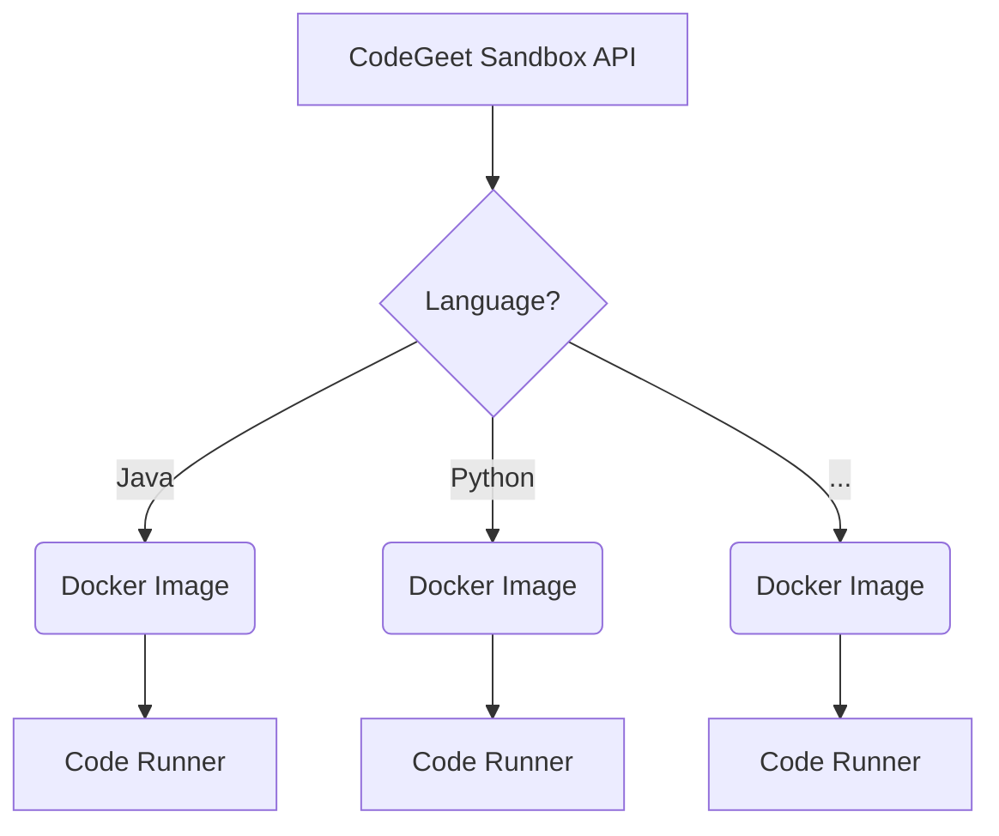

# CodeGeet
Here we build open-source online code execution system.

### Components

- [Sandbox](https://github.com/codegeet/sandbox/tree/main/api) API
- [Docker Images](https://github.com/codegeet/images) with [Code Runner](https://github.com/codegeet/sandbox/tree/main/coderunner) that is used by Sandbox  
  
### Overview



# Interface

`POST /execution`

**Body**

```json
{
  "code": "class Main {    public static void main(String[] args) {    System.out.print(\"Hello Jesus!\"); }   }",
  "language_id": "java"
}
```

**Response**

```json
{
  "execution_id": " ... "
}
```

`GET /execution/{execution_id}`

**Response**
```json
{
  "execution_id": "0f98b086-a060-4a78-a80e-4beb59460225",
  "language_id": "JAVA",
  "code": "class Main {    public static void main(String[] args) {    System.out.print(\"Hello Jesus!\"); }   }",
  "std_out": "Hello Jesus!",
  "std_err": "",
  "error": "",
  "exit_code": 0
}
```

# coderunner

## Overview
**coderunner** is a command-line tool that reads code in JSON format from the standard input (stdin),
compiles and executes the code, and then writes the result in JSON format to the standard output (stdout).

## Supported languages
- Java
- Python
- ... more to come ;)

## Input (stdin)
```json
{
  "language_id": "python",
  "content": "print(\"Hello, Python!\")"
}
```

## Output (stdout)
```json
{
  "std_out": "Hello, Python!\n",
  "std_err": "",
  "error": ""
}
```

## Special Thanks
Special thanks to similar open-source projects:
- [glot](https://github.com/glotcode)
- [Judge0](https://github.com/judge0)
