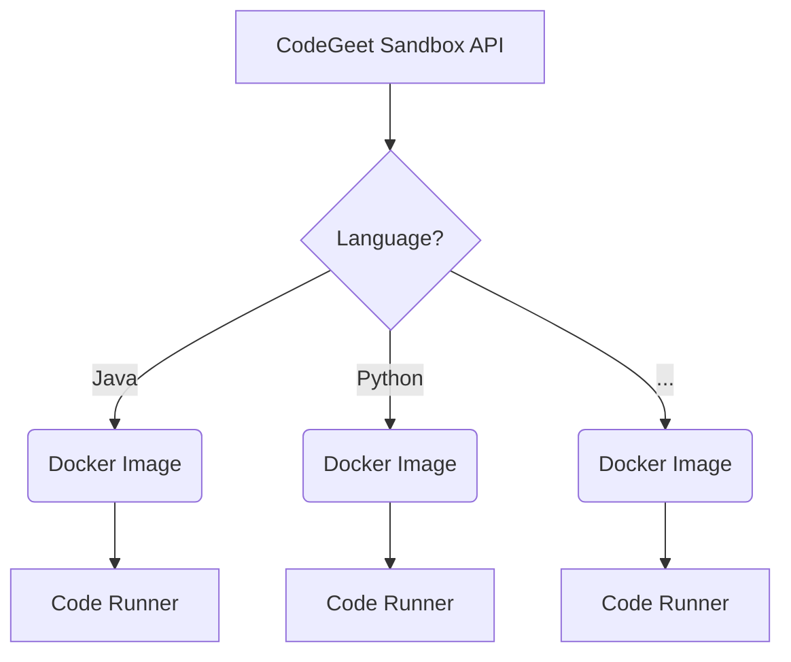

# CodeGeet
Here we build open-source online code execution system.

# CodeGeet 

Welcome to the Code Execution Platform, 
an open-source solution for executing code in isolated, secure Docker containers.  
This platform is designed to run code snippets in a variety of programming languages, ensuring a safe execution environment for code testing, development, and educational purposes.

Here you can fina a small [demo](https://codegeet.io/).

## Features

- **Isolated Execution**: Each code snippet runs in a separate Docker container, providing a secure and isolated environment.
- **Multi-Language Support**: Compatible with various programming languages, easily extendable to include more.
- **Scalable Architecture**: Designed to handle multiple concurrent code executions efficiently.
- **Easy Integration**: Offers a straightforward API for integrating with other applications and services.

## Getting Started

### Components

- [Platform](https://github.com/codegeet/codegeet) that runs Docer containers and provides an API
- [Docker Images](https://github.com/codegeet/codegeet/tree/main/images) for various programming languages
- [Code Runner](https://github.com/codegeet/codegeet/tree/main/coderunner) installed in a container to compile and execute the code 
  
### Overview



# Interface

`POST /execution`

**Body**

```json
{
  "code": "class Main { public static void main(String[] args) { System.out.print(\"Hello Jesus!\"); } }",
  "language_id": "java"
}
```

**Response**

```json
{
  "execution_id": " ... "
}
```

`GET /execution/{execution_id}`

**Response**
```json
{
  "execution_id": "0f98b086-a060-4a78-a80e-4beb59460225",
  "language_id": "JAVA",
  "code": "class Main { public static void main(String[] args) { System.out.print(\"Hello Java!\"); } }",
  "std_out": "Hello Java!",
  "std_err": "",
  "error": "",
  "exit_code": 0
}
```

# Coderunner

See [coderunner](https://github.com/codegeet/codegeet/tree/main/coderunner)

# Special Thanks
Special thanks for the inspiration to open-source projects:
- [glot](https://github.com/glotcode)
- [Judge0](https://github.com/judge0)
